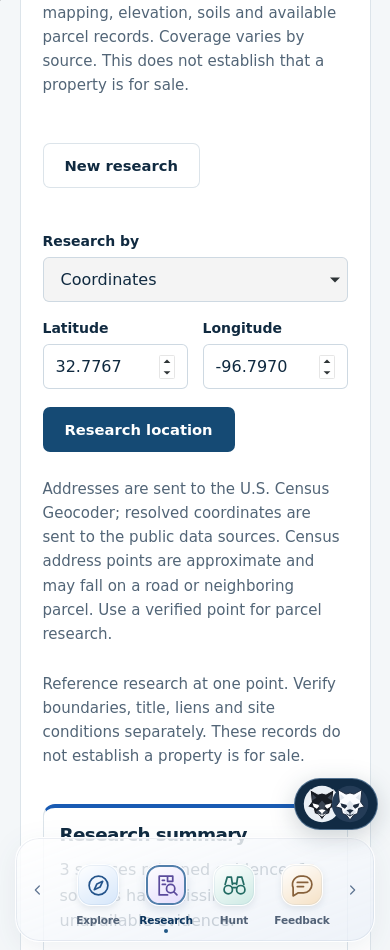
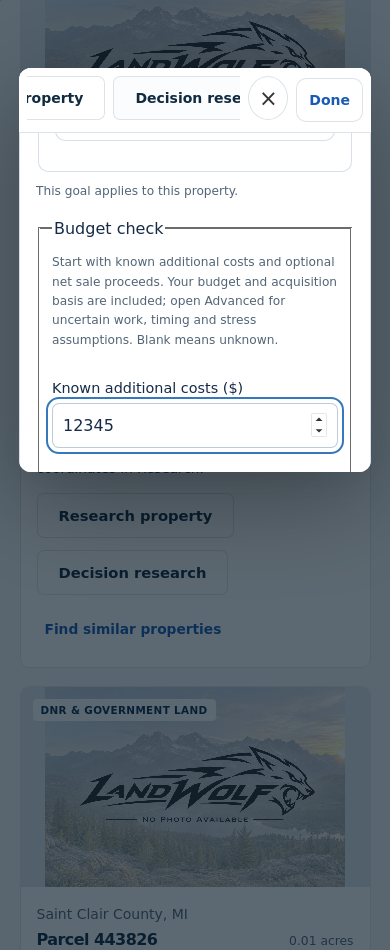

# Mobile research keyboard repair — v0.12.2 live

## Hosted acceptance follow-up — October 10, 2026

The original v0.12.1 tree `a2ee4071b305efc0f444b1b38f03706d2b0255f7`
deployed to isolated staging as `dep-db59irqjnfac739mufp0`, live at
2026-10-10 20:02:17 UTC. Exact hosted checks passed in run
`38082045473`, including four Chromium/WebKit research/calculation/navigation
journeys and both persistent-profile/cache/logout checks.

An additional phone/tablet hosted acceptance check exposed a pre-existing native
validation problem: after entering an invalid address and choosing Coordinates,
the hidden address remained subject to minlength validation and blocked submission.
The reciprocal case also applies to out-of-range coordinates hidden in Address mode.
The v0.12.2 follow-up disables only inactive inputs, preserving their values when
switching back. The six mobile research browser cases now cover both switches,
valid coordinate submission, coordinate boundaries and active-mode invalid values.

The additional acceptance tool lives on `codex/mobile-research-hosted-acceptance`;
its first run `38082530651` failed on an incorrect authenticated-session field
assumption, fixed to use `billing.allowed`. Its next run `38082693366` exposed
the inactive-field validation bug above. Neither failure was weakened or skipped.
Corrected candidate `deafae9734a589718bf99912cdfab94164bdafa0`, tree
`3b2fc5032a0146d96d0491c9a8fb4367a66aecc8`, reached isolated staging as
`dep-db59puflot8c73e70rq0`, live 2026-10-10 20:16:52 UTC. Focused hosted run
`38083071019` **Passed** all six Chromium/WebKit phone/tablet/desktop journeys:
both research editors, Done, focused navigation/Close, mode switching, validation,
entered-value retention after emulated transport/storage errors and successful
real-backend retries, input type size, dialog bounds and pinch zoom. Screenshots
were visually reviewed. OS keyboard geometry is explicitly emulated.

Standard exact hosted run `38083054592`, attempt 2, **Passed** four customer
journeys and both persistent-profile/cache/restart/logout checks at 20:23:21 UTC.
Attempt 1 **Failed** on HTTP 429 at the final WebKit sign-in because parallel
acceptance runs exhausted the normal sign-in rate limit. The rerun followed the
normal ten-minute limit window; no limit, security setting or test was weakened.

Full corrected-candidate gates **Passed**. PR #35 was marked ready and merged
as `f6cf068809bbc18ec9c8919156967a003e280b93`; its complete tree equals
staging tree `3b2fc5032a0146d96d0491c9a8fb4367a66aecc8`. Production
deployment `dep-db59v7lckfvc739fkme0` became live at
2026-10-10 20:28:08 UTC on that exact merge commit. The original v0.12.1
verification record below is historical and superseded.

## Production acceptance and preservation

[Standard exact production checks](https://github.com/lupu-spec/Landwolf/actions/runs/38083795499)
**Passed** at 20:29:02 UTC: HTTPS, exact immutable version/commit, database health,
expected live billing/email modes, four Chromium/WebKit phone/desktop login,
paywall/private-route boundaries and logout journeys, plus both persistent-cookie,
cache-clear, browser-restart and logout checks.

[Focused exact production checks](https://github.com/lupu-spec/Landwolf/actions/runs/38083927771)
**Passed** all six Chromium/WebKit 390/834/1440px journeys at 20:32:00 UTC.
Both Property research and Decision research passed Done, keyboard viewport
geometry, focused navigation/Close, native validation, mode switching, preservation
through emulated HTTP 503 transport/storage failures, successful real backend
retries, privacy boundaries and logout. No uncaught JavaScript errors occurred.
The production phone/tablet screenshots were visually reviewed: Close, Done and
the focused cost input remain within the emulated visible area.

The production account was newly created under a reserved smoke-test example.com
address. A one-day, audited owner grant enabled only this account's normal research
access; owner-only APIs still returned 403. Immediately after acceptance, the grant
was audited and revoked, all remaining sessions for this account were invalidated,
and zero active grants/sessions/Stripe customers were confirmed. No Stripe checkout,
webhook injection, charge, real-user entitlement change or customer record deletion
was performed. The hidden disposable account and its research records are retained.

Read-only PostgreSQL snapshots before deployment, afterward and after acceptance
matched exact row counts and SHA-256 digests for all pre-existing accounts (39),
billing customers (2), CRM contacts (40), activities (28), projects (1), access
reservations (1) and schema-version records (1). Account/CRM snapshots select
`created_at <= 1791662717` (2026-10-10 20:05:17 UTC), excluding newly registered
smoke accounts. Billing and schema snapshots cover the entire tables. Existing
service/database IDs, schema 12, origins, billing configuration and customer data
were preserved. No reset, restore or destructive migration ran against production.

Final read-only HTTPS checks confirmed both exact deployment identities and healthy
databases. Live staging/production `/assets/app.js` and `/assets/styles.css` matched
byte-for-byte, independently corroborating the equal source-tree check.

| Hosted command (from beta) | Result |
| --- | --- |
| `.venv/bin/python scripts/check_hosted_staging.py --environment staging --commit deafae9734a589718bf99912cdfab94164bdafa0` | **Passed**, run `38083054592`, attempt 2 |
| `.venv/bin/python -u scripts/check_hosted_mobile_research.py --environment staging --commit deafae9734a589718bf99912cdfab94164bdafa0` | **Passed**, run `38083071019`, six journeys |
| `.venv/bin/python scripts/check_hosted_staging.py --environment production --commit f6cf068809bbc18ec9c8919156967a003e280b93` | **Passed**, run `38083795499` |
| `.venv/bin/python -u scripts/check_hosted_mobile_research.py --environment production --commit f6cf068809bbc18ec9c8919156967a003e280b93` | **Passed**, run `38083927771`, six journeys |
| Acceptance tool Ruff format/lint, `py_compile` and Bandit | **Passed**, each hosted acceptance run |
| Read-only production row-count/digest comparison, exact identity/health and live JS/CSS comparison | **Passed**, authenticated service console |
| Physical iPhone/iPad/Android OS keyboards | **Not run**; viewport/failure simulation is explicit |

The additional acceptance script/workflow is retained separately on
`codex/mobile-research-hosted-acceptance`, production verification commit
`282f000743160a16e175de59f0f286aa15d8d474`. It is test tooling, not runtime
or deployed infrastructure. All screenshots are in the linked run artifact;
two production phone examples are retained here. No OS keyboard is drawn.

## Corrected v0.12.2 candidate command results

[Full beta gates](https://github.com/lupu-spec/Landwolf/actions/runs/38083031944)
completed successfully after the final runtime change on candidate
`deafae9734a589718bf99912cdfab94164bdafa0`. Every command below exited 0
in the hosted locked environment; the 18 focused browser cases are included in
the 108 unique full-suite cases, not additional tests.

| Command (from beta unless noted) | Result |
| --- | --- |
| `uv sync --frozen --dev`; `npm ci`; `.venv/bin/playwright install --with-deps chromium webkit` | **Passed** |
| `.venv/bin/ruff format --check landwolf tests scripts`; `npm run format:check` | **Passed** |
| `.venv/bin/ruff check landwolf tests scripts`; `npm run lint` | **Passed** |
| `.venv/bin/mypy landwolf`; `npm run typecheck` | **Passed** |
| `npm run test:unit` | **Passed**, 18 tests |
| `.venv/bin/pytest -q -m 'not browser'` | **Passed**, 536 tests |
| `.venv/bin/python scripts/check_postgres.py` | **Passed**, disposable database only |
| `.venv/bin/python scripts/check_restore.py` | **Passed**, exact digests across 32 restored tables |
| `npm run build` | **Passed** |
| `.venv/bin/pytest -q -m browser tests/test_mobile_research_browser.py tests/test_dock_browser.py tests/test_wolf_assistant_browser.py` | **Passed**, 18 focused cases |
| `.venv/bin/pytest -q -m browser` | **Passed**, 108 unique cases |
| `.venv/bin/python -m build`; `.venv/bin/python scripts/check_package.py` | **Passed**, wheel and sdist validated |
| `.venv/bin/bandit -r landwolf`; `.venv/bin/pip-audit --local --skip-editable` | **Passed**, no findings |
| `npm audit --audit-level=moderate`; `npm run secrets` | **Passed**, no findings |
| Root `git diff --check`; `git status --short` | **Passed** |
| Root `PYTHONPATH=. pytest -q` | **Passed**, 53 legacy tests in run `38083031946` |
| Root `PYTHONPATH=. pytest -q tests/unit/test_deployment_preflight.py` | **Passed**, release preflight run `38083031858` |

Local `.venv/bin/playwright install --with-deps chromium webkit` **Failed**
because apt requires permissions unavailable in this runner; the plain browser
installer also failed on blocked/truncated archives. Local browser tests,
disposable PostgreSQL/restore and the separately installed legacy suite were
**Not run**; the completed hosted gates above cover those execution gaps.
Local format/lint/types, frontend/backend tests, build/package, security,
`uv lock --check` and `git diff --check` **Passed** after the v0.12.2 change.
Physical iPhone/iPad/Android keyboard testing remains **Not run**.

Baseline: production v0.12.0 at `7b06ded06beca5bb4b54f3dcbaf83158e072c74f`,
Render `dep-db52sd7avr4c73f8u6l0`, observed live 2026-10-10 12:24:06 UTC.
The branch baseline is the subsequent documentation commit
`c0c9f728bd4921aa5a8f22cae0ec96b2adda610a`.

## Cause and behavior

The phone dock was fixed to the layout viewport instead of the visible viewport.
The property dialog used 92vh and a wrapping, sticky action header. Decision
inputs inherited 14.4px type, inviting iPhone focus zoom; New research also
opened the keyboard automatically. These combined to obscure navigation and
leave little space for research inputs and results.

`web/mobile-keyboard.ts` tracks bounded visual viewport resize/pan geometry,
with a layout-height fallback and no keyboard adjustment for pinch zoom. On
phones the dock becomes compact above the keyboard, with Done editing. Tablets
have a floating Done control. The native property dialog fits the visible area
and scrolls focused inputs below its compact header; its own Done and Close
remain reachable. Actions retain their titles and horizontally scroll on phones.
Touch controls stay stable between pointer down and click. Navigation and valid
research submissions dismiss the editor without clearing values; validation and
failed requests preserve normal correction and retry behavior. New research no
longer forces phone/tablet focus, and research inputs use 16px text.

Changes are browser layout/focus handling and regression/hosted checks, plus
release metadata. No dependency, API, calculation, schema, billing, account,
source, credential or infrastructure change is included.

## Verification

The two frontend viewport tests exercise iOS pan, Android layout resize, normal,
boundary, invalid/nonfinite geometry and pinch zoom. Six real Chromium/WebKit
browser/API/database cases exercise Property research and Decision research at
390/834/1440px: Done, entered-value preservation, valid submission, native invalid
input, provider/storage failure and retry, navigation/Close, visible modal header
and input, zoom and missing VisualViewport fallback. External research transport
uses explicit test fixtures; runtime never gains synthetic listings.

Physical iPhone/iPad/Android keyboard testing is **Not run**. Desktop Playwright
cannot show an OS keyboard; the new tests explicitly emulate viewport events.
Hosted checks additionally exercise the actual deployed focus/layout/Done controls
and normal real database/calculation/research journeys.

## Historical v0.12.1 candidate gates; superseded

The final code candidate is
`1a8cdb8f04d31de549ee4e6caefb7337f3cb641a`, tree
`855b310d07facb275316ddf33d9de75bb72327d9`. All three required PR workflows
completed successfully. [Full beta gates](https://github.com/lupu-spec/Landwolf/actions/runs/38057738782)
finished October 10, 2026 at 14:12 UTC. Each command below exited 0 in the
hosted locked environment after the final code change.

| Command (from beta unless noted) | Result |
| --- | --- |
| `uv sync --frozen --dev`; `npm ci`; `.venv/bin/playwright install --with-deps chromium webkit` | **Passed** |
| `.venv/bin/ruff format --check landwolf tests scripts`; `npm run format:check` | **Passed** |
| `.venv/bin/ruff check landwolf tests scripts`; `npm run lint` | **Passed** |
| `.venv/bin/mypy landwolf`; `npm run typecheck` | **Passed** |
| `npm run test:unit` | **Passed**, 18 tests |
| `.venv/bin/pytest -q -m 'not browser'` | **Passed**, 536 tests |
| `.venv/bin/python scripts/check_postgres.py` | **Passed**, disposable database only |
| `.venv/bin/python scripts/check_restore.py` | **Passed**, exact digests across 32 restored tables |
| `npm run build` | **Passed** |
| `.venv/bin/pytest -q -m browser tests/test_mobile_research_browser.py tests/test_dock_browser.py tests/test_wolf_assistant_browser.py` | **Passed**, 18 focused cases |
| `.venv/bin/pytest -q -m browser` | **Passed**, 108 unique cases |
| `.venv/bin/python -m build`; `.venv/bin/python scripts/check_package.py` | **Passed**, wheel and sdist validated |
| `.venv/bin/bandit -r landwolf`; `.venv/bin/pip-audit --local --skip-editable` | **Passed**, no findings |
| `npm audit --audit-level=moderate`; `npm run secrets` | **Passed**, no findings |
| Root `git diff --check`; `git status --short` | **Passed** |
| Root `PYTHONPATH=. pytest -q` | **Passed**, 53 legacy tests in run `38057738789` |
| Root `PYTHONPATH=. pytest -q tests/unit/test_deployment_preflight.py` | **Passed**, release preflight run `38057738787` |

Local format/lint/types, 18 frontend tests, 536 backend tests, build/package and
security checks also passed during preparation. Format/lint/types, frontend,
browser build, npm audit/secrets and diff integrity passed again after the final
focus-control edit. `uv lock --check` passed for version metadata. Local browser
executables, disposable PostgreSQL and the separate legacy pytest were unavailable;
the completed hosted checks above cover those environment gaps. Local physical
OS keyboard testing remains **Not run**.

Earlier candidates **Failed** on CSP-unsafe test wait expressions, overly broad
closed-chat hiding, fractional scroll bounds, WebKit touch-click cancellation
and a tablet acknowledgement checkbox moving during focus changes. These were
corrected without weakening assertions, removing tests or changing CSP. One
intermediate app.ts transfer was truncated; the tree comparison caught it before
any deployment. Full-file blob hashes and an exact local/remote tree comparison
were required for subsequent publication. The final full suite passed all these
existing and new paths, including login, chat, dock and simple/Advanced tools.

The final WebKit phone/tablet screenshots were visually reviewed: the compact
dialog header, Close, Done and focused cost field fit the emulated visible area.
No OS keyboard is drawn in these screenshots.

At the earlier inspection, this candidate remained in [draft PR #35](https://github.com/lupu-spec/Landwolf/pull/35).
**Not run:** v0.12.1 staging deployment, exact deployed staging journeys and
production promotion. The subsequent source-maintenance request permits only
verified source repairs to production; none was confirmed. The mobile change was
therefore kept separate and not deployed by that maintenance run. Production
remains v0.12.0 at the baseline commit above. Source check evidence is in
[SOURCE_MAINTENANCE_2026_10_10.md](SOURCE_MAINTENANCE_2026_10_10.md).
